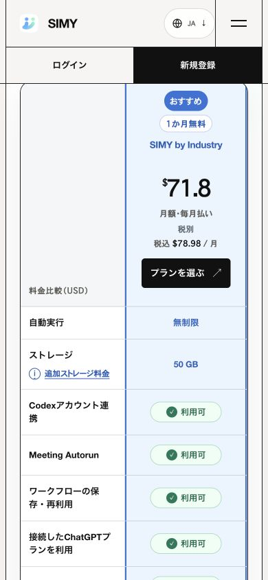
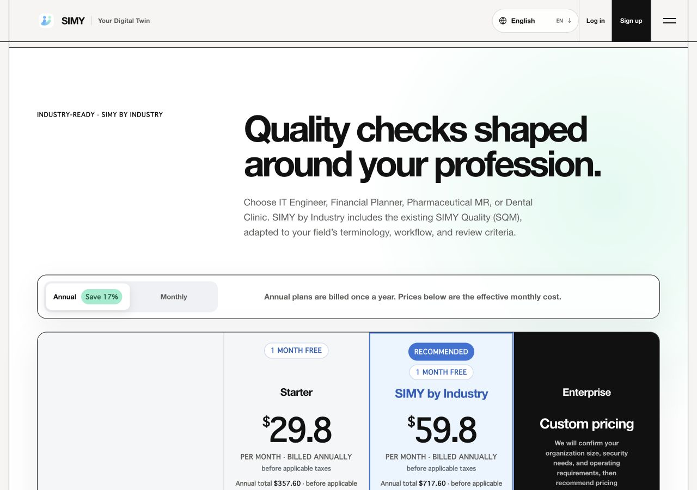

# Dev pricing handoff evidence

Purpose: preserve the existing offer and carry the chosen plan, billing period and language from the comparison table to the Dev signup page.

- Original plan prices, monthly/annual options, free-trial copy and feature descriptions are unchanged.
- `dev.simy.one` and local previews route app links to `app-dev.simy.one`; production keeps `app.simy.one`.
- 66 Node tests passed (`node --test tests/*.test.cjs tests/pricing-static.test.mjs`).
- CUA browser checks: 390px Japanese monthly ($35.80/$71.80; tax-inclusive $39.38/$78.98), 1280px English annual ($29.80/$59.80 monthly equivalents; annual $357.60/$717.60), and exact plan/interval/language query parameters.
- Independent review ran all 5 Playwright cases successfully with cached Chromium: Japanese/English at 390/1280px and an in-page language switch preserving the monthly selection.
- Dev deployment binds HTML app links to app-dev before upload, including no-JavaScript fallback; the reviewer verified zero production app links remain in transformed HTML. Production deployment does not perform this transform.
- This is homepage handoff evidence only. It does not prove authentication, Stripe Checkout or post-payment entitlement behavior. Those remain companion Dev application/backend release gates.

Release: merge to Dev after companion signup flow is verified. Production is outside this release. Rollback: revert the handoff changes; no pricing/catalog data changed.
