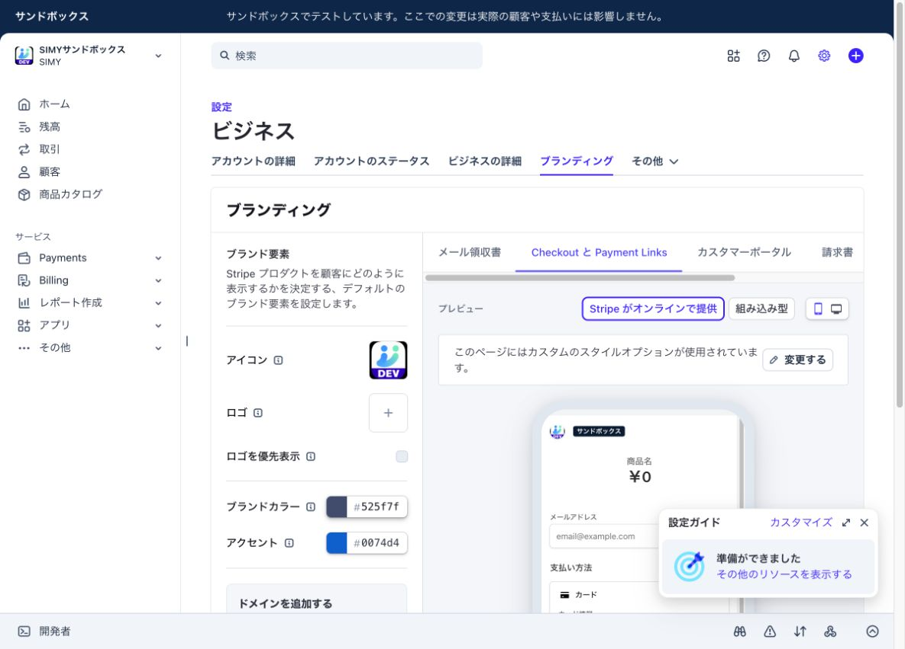

# Stripe branding assets

Use the following square icons for Stripe-hosted Checkout and customer-facing billing pages:

| Environment | Stripe icon asset | Purpose |
| --- | --- | --- |
| Production | `site/favicon-512.png` | Standard SIMY brand icon |
| Development / sandbox | `docs/stripe-assets/simy-icon-dev.png` | SIMY icon with a large `DEV` band for clear environment identification |

Stripe branding is configured in the Stripe Dashboard and is not deployed automatically from this repository. Upload the matching asset under **Settings → Business → Branding → Icon**, then save the branding changes.

## Verification

The development asset was uploaded and saved in the SIMY sandbox Stripe branding settings on 2026-07-12. The Checkout preview is shown below.

